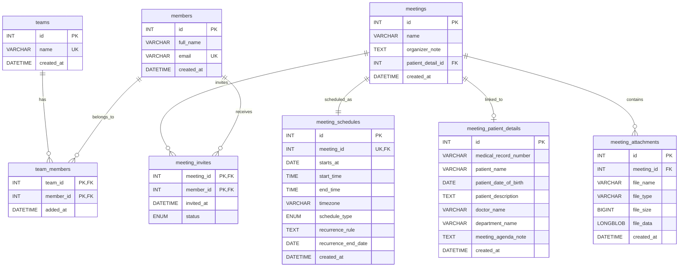

# ER Diagram

This ER diagram is derived from the MySQL model in `db/schema.sql`.

## Relationship Summary

- **teams ↔ members**: many-to-many through `team_members`.
- **meetings ↔ meeting_schedules**: one-to-one through `meeting_schedules.meeting_id` (unique foreign key).
- **meetings ↔ meeting_patient_details**: one-to-one optional relationship. A meeting can optionally reference patient details via `patient_detail_id`. Patient details can exist independently and be linked to a meeting later.
- **meetings ↔ meeting_attachments**: one-to-many. A meeting can have multiple file attachments (documents, images, scan reports).
- **meetings ↔ members**: many-to-many through `meeting_invites`.

## Table Descriptions

### Core Tables

- **teams**: Organizational teams or groups.
- **members**: Individual members with email and full name.
- **team_members**: Junction table linking members to teams.

### Meeting Tables

- **meetings**: Core meeting entity with name and optional organizer notes.
- **meeting_schedules**: Scheduling information for each meeting (date, time, timezone, recurrence).
- **meeting_invites**: Many-to-many relationship between meetings and members with invitation status.
- **meeting_attachments**: File attachments for meetings stored as binary data (LONGBLOB).

### Medical/Patient Tables

- **meeting_patient_details**: Patient and doctor information that can optionally be linked to meetings. Includes medical record number, patient demographics, doctor details, and meeting agenda notes.

## Notes

- Junction tables (`team_members`, `meeting_invites`) use composite primary keys to prevent duplicate mappings.
- Cascading deletes are enabled on foreign keys:
  - Deleting a team removes all `team_members` associations.
  - Deleting a member removes all `team_members` and `meeting_invites` associations.
  - Deleting a meeting removes all `meeting_schedules`, `meeting_attachments`, and `meeting_invites`.
  - Deleting patient details sets `patient_detail_id` to NULL in linked meetings (ON DELETE SET NULL).
- **ENUM constraints**:
  - `meeting_schedules.schedule_type`: `one-time` or `recurring`
  - `meeting_invites.status`: `pending`, `accepted`, or `declined`
- **Patient details** can be created independently without linking to a meeting, allowing flexible workflow where patient information is entered first and meetings scheduled later.
- **File attachments** are stored directly in the database as binary data (LONGBLOB) with metadata including file name, type, and size.
