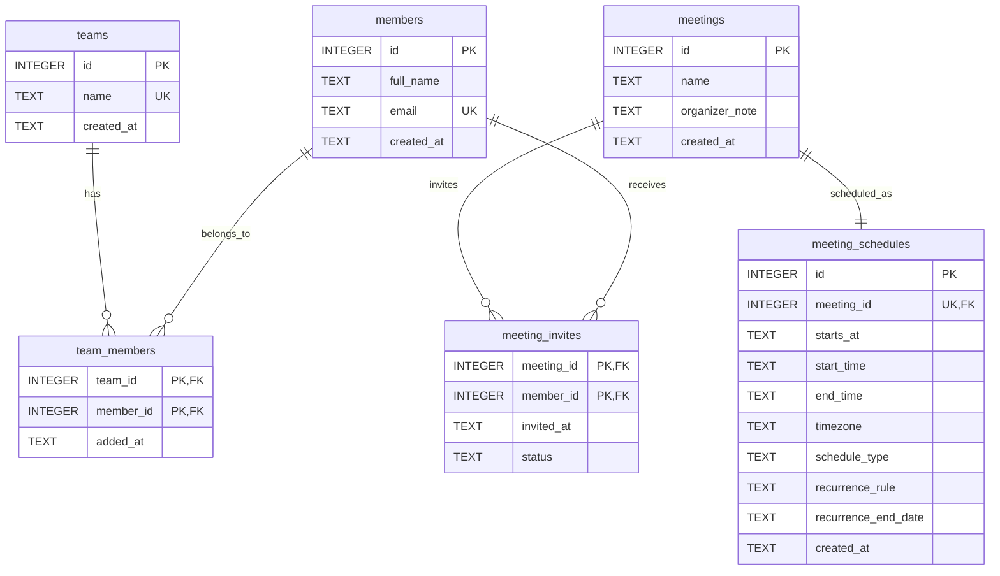

# ER Diagram

This ER diagram is derived from the SQLite model in `db/schema.sql`.

## Relationship Summary

- **teams ↔ members**: many-to-many through `team_members`.
- **meetings ↔ meeting_schedules**: one-to-one through `meeting_schedules.meeting_id` (unique foreign key).
- **meetings ↔ members**: many-to-many through `meeting_invites`.

## Notes

- Junction tables (`team_members`, `meeting_invites`) use composite primary keys to prevent duplicate mappings.
- Cascading deletes are enabled on all foreign keys in the schema, so related join/schedule rows are removed when a parent record is deleted.
- `meeting_schedules.schedule_type` is constrained to `one-time` or `recurring`, and invite `status` is constrained to `pending`, `accepted`, or `declined`.
