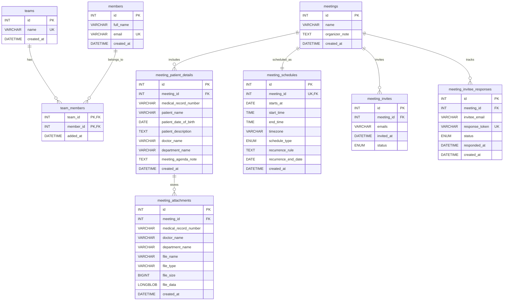

# ER Diagram

This ER diagram is derived from the MySQL model in `db/schema.sql`.

## Relationship Summary

- **teams ↔ members**: many-to-many through `team_members`.
- **meetings ↔ meeting_schedules**: one-to-one through `meeting_schedules.meeting_id` (unique foreign key).
- **meetings ↔ meeting_patient_details**: one-to-many. A meeting can have multiple patient detail rows.
- **meeting_patient_details ↔ meeting_attachments**: one-to-many through the composite foreign key on patient details.
- **meetings ↔ meeting_invites**: one-to-many. A meeting stores its invited email list in `meeting_invites`.
- **meetings ↔ meeting_invitee_responses**: one-to-many. Tracks per-invitee response tokens and RSVP status.

## Table Descriptions

### Core Tables

- **teams**: Organizational teams or groups.
- **members**: Individual members with email and full name.
- **team_members**: Junction table linking members to teams.

### Meeting Tables

- **meetings**: Core meeting entity with name and optional organizer notes.
- **meeting_schedules**: Scheduling information for each meeting (date, time, timezone, recurrence).
- **meeting_invites**: Stores invited email list per meeting and overall invite status.
- **meeting_invitee_responses**: Per-invitee response tokens and RSVP status.
- **meeting_attachments**: File attachments for meetings stored as binary data (LONGBLOB), linked to patient details.

### Medical/Patient Tables

- **meeting_patient_details**: Patient and doctor information that can optionally be linked to meetings. Includes medical record number, patient demographics, doctor details, and meeting agenda notes.

## Notes

- Junction tables (`team_members`) use composite primary keys to prevent duplicate mappings.
- Cascading deletes are enabled on foreign keys:
  - Deleting a team removes all `team_members` associations.
    - Deleting a member removes all `team_members` associations.
    - Deleting a meeting removes all `meeting_schedules`, `meeting_patient_details`, `meeting_attachments`, `meeting_invites`, and `meeting_invitee_responses`.
    - Deleting patient details removes linked `meeting_attachments` rows via the composite foreign key.
- **ENUM constraints**:
  - `meeting_schedules.schedule_type`: `one-time` or `recurring`
    - `meeting_invites.status`: `Pending`, `Accept`, `Decline`, or `Tentative`
    - `meeting_invitee_responses.status`: `Pending`, `Accept`, `Decline`, or `Tentative`
- **Patient details** are scoped to a meeting via `meeting_patient_details.meeting_id` with uniqueness enforced per meeting, medical record number, doctor, and department.
- **File attachments** are stored directly in the database as binary data (LONGBLOB) with metadata including file name, type, and size.
